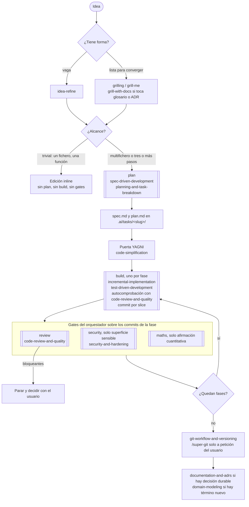

# Flujo maker

Mapa visual de la persona `maker`: qué skill gobierna cada fase, qué subagente
la ejecuta y qué guardarraíles mecánicos la respaldan. La fuente normativa es
`AGENTS.md`; si este documento y aquel divergen, manda `AGENTS.md`. Los nombres
de subagente son los de Claude Code y OpenCode; en Codex las mismas fases son
pasadas del flujo descrito en `codex/.codex/AGENTS.md`.

## El camino de un cambio

Los rectángulos de doble borde son subagentes (contexto aislado, el orquestador
integra su resumen). El resto lo hace el orquestador con la skill indicada.

Notas del tramo central:

- El reparto de gates viene de que `build` no puede lanzar subagentes.
  `build` se autocomprueba con las skills y commitea; el orquestador corre
  `review` y `security` sobre el rango de commits que cada fase devuelve.
  `security` es gate de fase, no de slice.
- Con la idea aún sin forma no hay subagente: el propio orquestador sostiene
  más de un encuadre (herencia del antiguo agente `debate`).

## Transversales

Entran en cualquier punto del camino, no en una fase concreta.

| Situación | Skill o mecanismo | Quién |
|---|---|---|
| Comportamiento atado a docs, versiones o APIs externas | `source-driven-development` | quien implemente |
| Tests, build o runtime rotos | `debugging-and-error-recovery` | quien implemente |
| Herramienta que falla | `tool-error-recovery` antes de cualquier reintento | todos |
| Decisión humana pendiente | `wait-for-user`: una pregunta cerrada o la línea `WAIT_FOR_USER:` y parar | todos; los subagentes devuelven la señal al orquestador |
| Código que funciona pero pesa más de lo necesario | `code-simplification` | orquestador o `build` |
| Prosa en castellano de un entregable | `castellano-peninsular` y `anti-ai-style` (el chat no las carga) | quien redacte |
| Cambio de agente o pausa con trabajo en vuelo | `handoff` a `.ai/tasks/<slug>/handoff.md` | orquestador |
| Presupuesto de contexto | statusline: oro a ~90k cierra la fase, rosa a ~160k traspasa | orquestador |

## La red mecánica

Hooks de Claude Code registrados en `settings.json`. Son el respaldo del
contrato, no su sustituto: la medición del refinamiento de agosto de 2026
enseñó que el gate de revisión lo produce el hook, no la prosa.

| Hook | Momento | Efecto |
|---|---|---|
| `remind-load-skills.sh` | primera escritura de cada agente (Write/Edit y también Bash) | recuerda cargar la skill de la fase antes de escribir |
| `remind-review-gate.sh` | `git commit` | en el orquestador recuerda el gate si no consta; dentro de un subagente bloquea el primer commit sin autocomprobación |
| `block-dangerous-git.sh` | cada comando Bash | bloquea Git y Stow destructivos, el push a la rama por defecto y la atribución de LLM en commits |
| `verify-phase-close.sh` | al terminar un subagente `build` | inyecta al orquestador el estado real del árbol y los últimos commits para contrastar el resumen de la fase |

En OpenCode el equivalente son los permisos por frontmatter de cada agente; en
Codex, el sandbox y las aprobaciones. La tabla de paridad completa está en
`AGENTS.md`.
