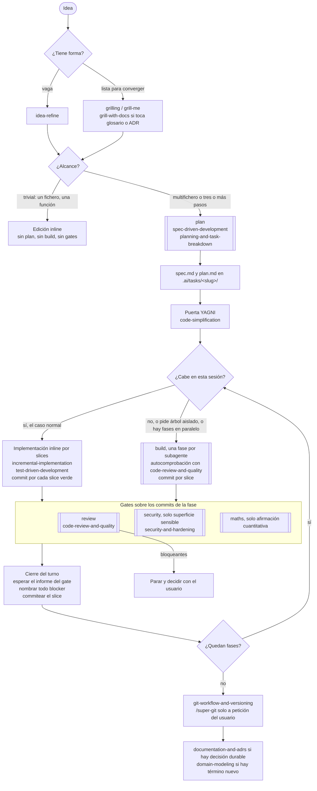

# Flujo maker

Mapa visual de la persona `maker`: qué skill gobierna cada fase, qué subagente
la ejecuta y qué guardarraíles mecánicos la respaldan. La fuente normativa es
`AGENTS.md`; si este documento y aquel divergen, manda `AGENTS.md`. Los nombres
de subagente son los de Claude Code y OpenCode; en Codex las mismas fases son
pasadas del flujo descrito en `codex/.codex/AGENTS.md`.

## El camino de un cambio

Los rectángulos de doble borde son subagentes (contexto aislado, la sesión
principal integra su resumen). El resto lo hace la sesión principal con la skill
indicada.

Notas del tramo central:

- La bifurcación de `cabe` cambió el 2026-09-02 con los datos de I2 del examen
  del flujo. Orquestar cinco fases dependientes empató a 31/31 con el brazo
  inline en los tests ocultos, costó 4,87 veces más, tardó 6,66 veces más y no
  bajó el contexto pico del orquestador (108,2k inline frente a 111,6k). Tener
  varias fases dejó de ser razón para delegar; hace falta que el trabajo no
  quepa en la sesión, que una fase necesite árbol aislado o que haya fases
  paralelizables.
- El reparto de gates viene de que `build` no puede lanzar subagentes.
  `build` se autocomprueba con las skills y commitea; quien orquesta corre
  `review` y `security` sobre el rango de commits que cada fase devuelve.
  `security` es gate de fase, no de slice.
- Toda delegación al `Agent` vuelve como `async_launched`: el subagente sigue
  corriendo en segundo plano y su informe llega después. Cerrar el turno sin
  esperarlo entrega trabajo sin revisar mientras el resumen dice lo contrario,
  que es lo que midió I1.
- Con la idea aún sin forma no hay subagente: el propio orquestador sostiene
  más de un encuadre (herencia del antiguo agente `debate`).

## Transversales

Entran en cualquier punto del camino, no en una fase concreta.

| Situación | Skill o mecanismo | Quién |
|---|---|---|
| Comportamiento atado a docs, versiones o APIs externas | `source-driven-development` | quien implemente |
| Tests, build o runtime rotos | `debugging-and-error-recovery` | quien implemente |
| Herramienta que falla | `tool-error-recovery` antes de cualquier reintento | todos |
| Decisión humana pendiente | `wait-for-user`: una pregunta cerrada o la línea `WAIT_FOR_USER:` y parar | todos; los subagentes devuelven la señal al orquestador |
| Código que funciona pero pesa más de lo necesario | `code-simplification` | quien implemente |
| Prosa en castellano de un entregable | `castellano-peninsular` y `anti-ai-style` (el chat no las carga) | quien redacte |
| Cambio de agente o pausa con trabajo en vuelo | `handoff` a `.ai/tasks/<slug>/handoff.md` | sesión principal |
| Presupuesto de contexto | statusline: oro a ~90k cierra la fase, rosa a ~160k traspasa con `handoff`; delegar no lo baja | quien implemente |

## La red mecánica

Hooks de Claude Code registrados en `settings.json`. Son el respaldo del
contrato, no su sustituto: la medición del refinamiento de agosto de 2026
enseñó que el gate de revisión lo produce el hook, no la prosa.

| Hook | Momento | Efecto |
|---|---|---|
| `remind-load-skills.sh` | primera escritura de cada agente (Write/Edit y también Bash) | recuerda cargar la skill de la fase antes de escribir |
| `remind-review-gate.sh` | `git commit` | en el orquestador recuerda el gate si no consta; dentro de un subagente bloquea el primer commit sin autocomprobación |
| `block-dangerous-git.sh` | cada comando Bash | bloquea Git y Stow destructivos, el push a la rama por defecto y la atribución de LLM en commits |
| `verify-phase-close.sh` | al terminar un subagente `build` | inyecta al orquestador el estado real del árbol y los últimos commits para contrastar el resumen de la fase |
| `close-review-gate.sh` | al cerrar el turno el principal | no deja cerrar con un gate lanzado y sin cosechar, ni con un `blocker` que el cierre no nombra |
| `verify-slice-commit.sh` | al cerrar el turno el principal | no deja cerrar con un fichero que la sesión ha editado y sigue sin commitear |

Los dos últimos van en `Stop`, que solo alcanza al principal: los subagentes
paran por `SubagentStop`. Bloquean una vez y se apartan, porque un hook que
entra en bucle es peor que no tenerlo. La medición que los motiva está en
`.ai/tasks/2026-08-31-examen-flujo-maker/` (off-git).

En OpenCode el equivalente son los permisos por frontmatter de cada agente; en
Codex, el sandbox y las aprobaciones. La tabla de paridad completa está en
`AGENTS.md`.
